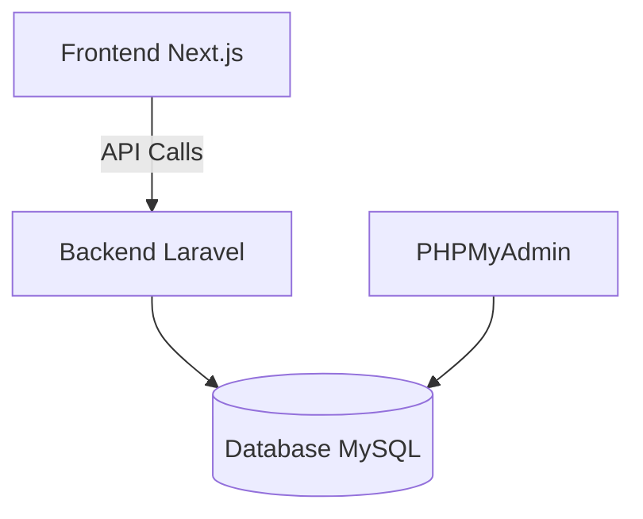

<p align="center">
  
</p>

<h1 align="center">🌾 AgriTrack Fullstack</h1>

<p align="center">
  Plateforme complète de gestion agricole avec Next.js (frontend) et Laravel (backend)
</p>

---

## 🚀 À propos

AgriTrack est une solution complète pour :
- **Frontend** : Application Next.js moderne avec App Router
- **Backend** : API REST Laravel avec Sanctum
- **Fonctionnalités** :
  - Gestion des parcelles agricoles
  - Suivi des cultures
  - Planification des interventions
  - Tableaux de bord analytiques

---

## 🧩 Architecture



---

## 🛠 Technologies

| Composant | Stack |
|-----------|-------|
| **Frontend** | Next.js 14, TypeScript, Tailwind CSS, Geist Font |
| **Backend** | Laravel 12, PHP 8.3, MySQL, Sanctum |
| **Infra** | Docker, Nginx, PHPMyAdmin |

---

## 🐳 Démarrage avec Docker

### Prérequis
- Docker 20+
- Docker Compose 2+

### 1. Cloner le projet
```bash
git clone https://github.com/votre-repo/agritrack-fullstack.git
cd agritrack-fullstack
```

### 2. Configuration de l'environnement
```bash
cp backend/.env.example backend/.env
cp frontend/.env.example frontend/.env.local
```

### 3. Démarrer les containers
```bash
docker-compose up -d --build
```

### 4. Initialiser le backend
```bash
docker exec agritrack-backend composer install
docker exec agritrack-backend php artisan key:generate
docker exec agritrack-backend php artisan migrate --seed
```

---

## 🌐 Accès aux services

| Service | URL | Credentials |
|---------|-----|-------------|
| Frontend | http://localhost:3000 | - |
| Backend API | http://localhost:8000 | - |
| PHPMyAdmin | http://localhost:8080 | root:rootpassword |

---

## 🖥 Développement local (sans Docker)

### Frontend
```bash
cd frontend
npm install
npm run dev
```

### Backend
```bash
cd backend
composer install
php artisan serve
```

---

## 🔧 Commandes utiles

### Frontend
```bash
# Builder l'image Docker
docker build -t agritrack-frontend .

# Accéder au container
docker exec -it agritrack-frontend sh
```

### Backend
```bash
# Exécuter les tests
docker exec agritrack-backend php artisan test

# Voir les routes
docker exec agritrack-backend php artisan route:list
```

---

## 🌱 Données de démo

Le système inclut des données de test :
- 1 administrateur (`admin@agritrack.com` / `password`)
- 10 parcelles avec cultures
- 50 interventions historiques

---

## 🚀 Déploiement

### Vercel (Frontend)
```bash
vercel --prod
```

### Laravel Forge (Backend)
Configurer avec :
- PHP 8.3
- Queue Workers
- Storage link

---


